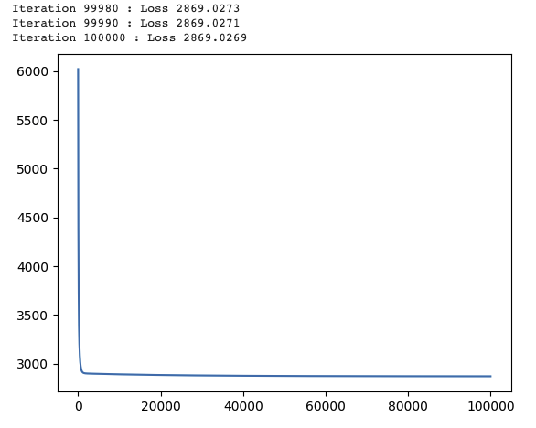
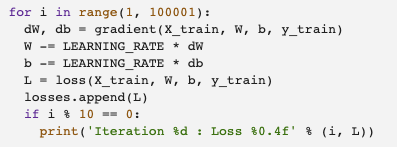

# AIFFEL Campus Online Code Peer Review Templete
- 코더 : 이명준
- 리뷰어 : 정호재


# PRT(Peer Review Template)
- [X]  **1. 주어진 문제를 해결하는 완성된 코드가 제출되었나요?**
    - Problem solved(ex1_1.ipynb): MSE value record under 3000
    - Problem solved(ex1_2.ipynb): MSE value record under 150
        - 
    
- [X]  **2. 전체 코드에서 가장 핵심적이거나 가장 복잡하고 이해하기 어려운 부분에 작성된 
주석 또는 doc string을 보고 해당 코드가 잘 이해되었나요?**
    - Project 1
        - Required annotaions on the below script
        - The following for loop is the part to find the values of W and b that minimize the loss, essentially the training part.
        It would be helpful to include this comment to clarify its purpose.  
            -  
    - Project 2
        - Required more annotaions
        
- [X] **3. 에러가 난 부분을 디버깅하여 문제를 “해결한 기록을 남겼거나” 
"새로운 시도 또는 추가 실험을 수행”해봤나요?**
    - Project 2
        - Min-max scaling on 'windspeed_2', 'atemp_2','humidity_2','month_2','hour_2' features
        - Retrieve W, b without using sklearn
        
- [ ]  **4. 회고를 잘 작성했나요?**
    - Please write the review of this project!
        
- [X]  **5. 코드가 간결하고 효율적인가요?**
    - Recommend printing a subset of the output values
      ``` 
          # in 'ex1_1.ipynb'
          # Your code 
          if i % 10 == 0:
          print('Iteration %d : Loss %0.4f' % (i, L))
          
          # Recommended code
          if i % 1000 == 0:
          print('Iteration %d : Loss %0.4f' % (i, L))
      ```


# 참고 링크 및 코드 개선
```
# 코드 리뷰 시 참고한 링크가 있다면 링크와 간략한 설명을 첨부합니다.
# 코드 리뷰를 통해 개선한 코드가 있다면 코드와 간략한 설명을 첨부합니다.
```
